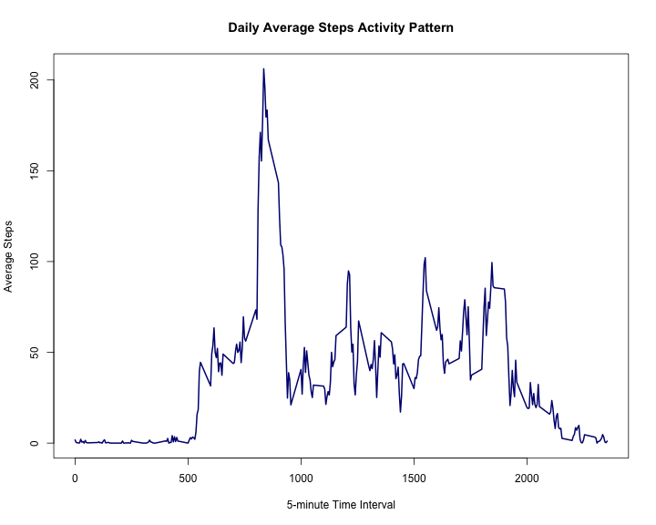
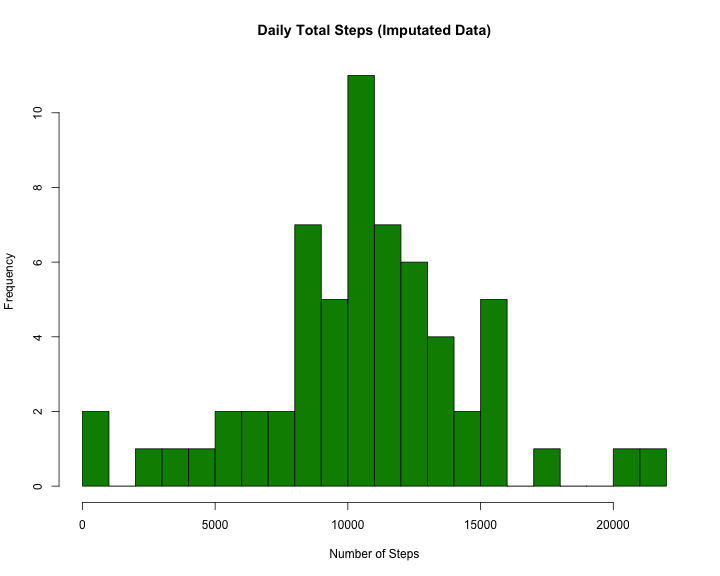
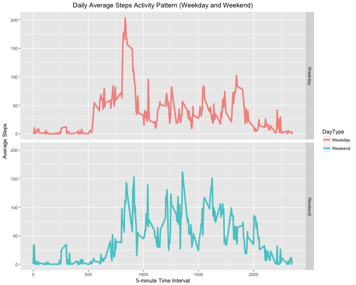

# Introduction

<span style = "color: red"> This is my first R markdown document for Project 1 in Reproducible Research course. Thank you for the time and efforts in reviewing my document. </span>

It is now possible to collect a large amount of data about personal movement using activity monitoring devices such as a Fibit, Mike Fuelband, or Jawbone Up. These type of devices are part of the "quantified self" movement: a group of enthusiasts about themselves refularly to improve their health, to find patterns in their behavior, or because they are tech geeks. But these data remain under-utilized both because the raw data are hard to obtain and there is a lack of statistical methods and software for processing and interrupting the data.

This assignment makes use of data from a personal activity monitoring device. This device collects data at 5 minutes intervals through out the day. The data consists of two months of data from an anonymous individual collected during the months of October and November, 2012 and include the number of steps taken in 5 minute intervals each day. 

# Data Source

The dataset for this assignment is downloaded from course website from Coursera. Data structure is listed as below:

* Oberservations: There are a total of 17,568 observations in this dataset

* Variables:
    + __steps__: Numbers of steps taking in a 5-minute interval (missing data are coded as <span style = "color: red"> NA </span>)
    + __date__: The data on which the measurement was taken in YYYY-MM-DD format
    + __interval__: Identifier for the 5-minute interval in which measurement was taken

# Loading Libraries and Pre-processing Data


```r
library(knitr)
library(dplyr)
library(ggplot2)
library(mice)
```


```r
data <- read.csv(file = "activity.csv", header = TRUE, sep = ",")
data$date <- as.Date(data$date, format = "%Y-%m-%d")
glimpse(data)
```

```
## Observations: 17,568
## Variables: 3
## $ steps    <int> NA, NA, NA, NA, NA, NA, NA, NA, NA, NA, NA, NA, NA, N...
## $ date     <date> 2012-10-01, 2012-10-01, 2012-10-01, 2012-10-01, 2012...
## $ interval <int> 0, 5, 10, 15, 20, 25, 30, 35, 40, 45, 50, 55, 100, 10...
```

# What is mean total number of steps taken per day?

This part is to calculate the total number of steps taken per day and report the mean and median of total steps taken per day.  


```r
TotalSteps <- data %>%
                group_by(date) %>%
                    summarize(Total = sum(steps, na.rm = TRUE))
AvgStep <- mean(TotalSteps$Total, na.rm = TRUE)
MedianStep <- median(TotalSteps$Total, na.rm = TRUE)
TotalStepPlot <- hist(TotalSteps$Total, main = "Daily Total Steps", xlab = "Number of Steps", ylab = "Frequency", breaks = 25, col = "navy")
```


The average of the total number of steps taken per day is 9354.2295082.  
The median of the total number of steps taken per day is 10395

# What is the average daily activity pattern?

This part is to show the activity pattern of average steps taken on a daily basis in a time series plot.  


```r
AvgInterval <- data %>%
                group_by(interval) %>%
                  summarize(Average = mean(steps, na.rm = TRUE))
MaxInterval <- AvgInterval$interval[which.max(AvgInterval$Average)]
plot(x = AvgInterval$interval, y = AvgInterval$Average, type = "l", col = "navy", lwd = 2, xlab = "5-minute Time Interval", ylab = "Average Steps", main = "Daily Average Steps Activity Pattern")
```



The 835th 5-minute interval on average across all the days contains the maximum number of steps.

# Imputing Missing Values

```r
Missing <- md.pattern(data)
print(Missing)
```

```
##       date interval steps     
## 15264    1        1     1    0
##  2304    1        1     0    1
##          0        0  2304 2304
```
Since there are a number of days and intervals with missing values (coded as NA)，it may introduce bias into some calculations or summaries of data. There are 15264 rows in the dataset that are complete. There are  2304 rows of missing values in the dataset. The missing data are going to be replaced with the method of multiple imputation by chained equation.

```r
data$date <- as.factor(data$date)
ImpData <- mice(data, m = 5, meth = 'pmm')
CompData <- complete(ImpData, 3)
data$date <- as.Date(data$date, format = "%Y-%m-%d")
CompData$date <- as.Date(CompData$date, format = "%Y-%m-%d")
```
The new dataset, CompData, does not have any missing value in it and the checking is listed as below:

```r
md.pattern(CompData)
```

```
##      steps date interval  
## [1,]     1    1        1 0
## [2,]     0    0        0 0
```
Now with missing data imputated, this is to calculate the total number of steps taken per day and report the mean and median of total steps taken per day.  


```r
TotalCompSteps <- CompData %>%
                group_by(date) %>%
                    summarize(TotalComp = sum(steps))
AvgCompStep <- format(mean(TotalCompSteps$TotalComp), scientific = FALSE)
MedianCompStep <- median(TotalCompSteps$TotalComp)
TotalCompStepPlot <- hist(TotalCompSteps$TotalComp, main = "Daily Total Steps (Imputated Data)", xlab = "Number of Steps", ylab = "Frequency", breaks = 25, col = "green4")
```



The average of the total number of steps taken per day is 10570.57  
The median of the total number of steps taken per day is 10571
Comparing to the estimates done from the first part, the gap between the mean and the median is smaller than it was before. The imputated data are less skewed on the estimates of the total daily number of steps.

# Are there differences in activities patterns between weekdays and weekends?
This is to compare the activity pattern between weekdays and weekend to see if there is any difference in the intervals. Apparently, the starting time of increasing activity has shifted to the right, which means people tend to start late on weekend. 

```r
CompData$DayType <- ifelse(weekdays(CompData$date) %in% c("Saturday", "Sunday"), "Weekend", "Weekday")
CompInterval <- CompData %>%
                  group_by(interval, DayType) %>%
                    summarize(IntervalAvg = mean(steps))
IntervalPlot <- ggplot(CompInterval, aes( x = interval, y = IntervalAvg, color = DayType))
IntervalPlot + geom_line(size = 1.5, alpha = 0.75) + facet_grid(DayType ~ .) + labs(title = "Daily Average Steps Activity Pattern (Weekday and Weekend)", x= "5-minute Time Interval", y = "Average Steps") + theme(plot.title = element_text(hjust = 0.5))
```


